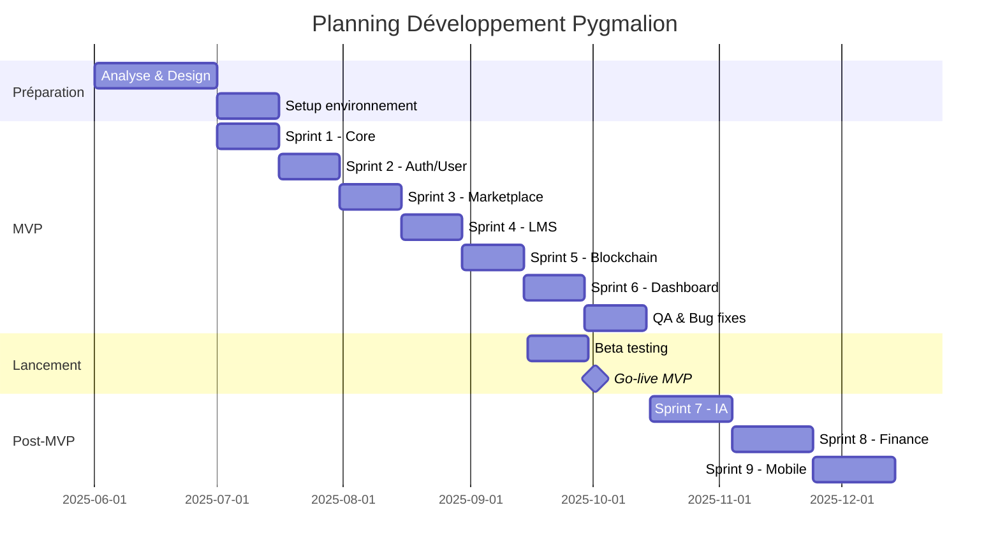
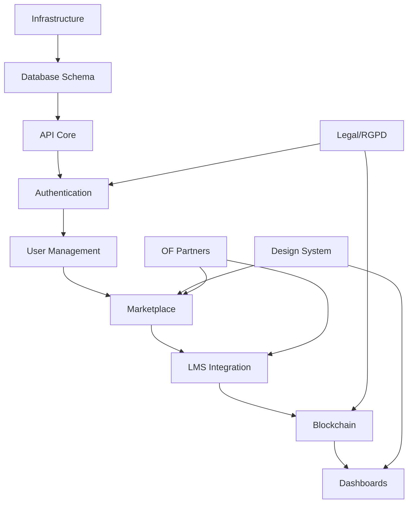

---
**DOCUMENT CONFIDENTIEL**


# PDD - PLAN DE DÉVELOPPEMENT DÉTAILLÉ
## PYGMALION - Marketplace de Formation Aéronautique

**Projet :** Pygmalion - Plateforme de Formation Aéronautique  
**Version :** 1.0  
**Date :** Août 2025  
**Classification :** Confidentiel

---

## **1. INTRODUCTION & CONTEXTE**

### **1.1 Contexte du projet**

Le secteur aéronautique fait face à des défis majeurs en matière de formation et de conformité réglementaire. Les entreprises du secteur (compagnies aériennes, aéroports, prestataires) peinent à gérer efficacement les formations obligatoires de leurs personnels dans un environnement ultra-réglementé.

**Problématiques identifiées :**
- Fragmentation de l'offre de formation (200+ OF isolés)
- Complexité du suivi des certifications et échéances
- Absence d'outil centralisé pour la conformité
- Lourdeur administrative (45% du temps RH)
- Risque de non-conformité élevé (30% d'anomalies en audit)

### **1.2 Solution Pygmalion**

Pygmalion est une marketplace hypersécurisée dédiée à la formation aéronautique, intégrant nativement un LMS multimodal et un système de tokenisation blockchain des certificats. La plateforme centralise, sécurise et automatise l'ensemble du cycle de formation.

### **1.3 Porteurs du projet**

- **Société porteuse :** MB Aviation
- **Société éditrice :** Kepler Aviation
- **Équipe dirigeante :** Robin Navarro (CEO), Aurélien Francio (CTO), Pierre Beunardeau (COO)

---

## **2. OBJECTIFS & PORTÉE DU PROJET**

### **2.1 Objectifs stratégiques**

1. **Court terme (6 mois)**
   - Lancer un MVP fonctionnel avec 5-10 OF partenaires
   - Gérer 400-10,000 inscriptions selon stratégie MB Aviation
   - Valider le modèle économique commission pure (15-20%)
   - Démontrer la valeur ajoutée de la tokenisation blockchain

2. **Moyen terme (12 mois)**
   - Devenir la référence française de la formation aéronautique
   - Atteindre 2,000-10,000 utilisateurs actifs
   - Générer 120K-600K€ ARR
   - Obtenir les certifications réglementaires

3. **Long terme (24+ mois)**
   - Expansion internationale (Europe, Moyen-Orient)
   - Leader mondial de la formation aéronautique certifiée
   - 50,000+ utilisateurs actifs
   - Introduction en bourse envisagée

### **2.2 Portée du projet**

**Dans le périmètre :**
- Marketplace de formations aéronautiques
- LMS intégré multimodal
- Tokenisation blockchain des certificats
- Gestion de la conformité réglementaire
- Tableaux de bord multi-acteurs
- Système d'alertes automatisé

**Hors périmètre (phase 1) :**
- Formations hors aéronautique
- Création de contenu pédagogique
- Consulting et audit
- Hardware spécifique

---

## **3. VISION PRODUIT & FONCTIONNALITÉS**

### **3.1 Vision produit**

> **"Devenir l'Udemy de la formation aéronautique avec la sécurité d'une banque et la traçabilité de la blockchain"**

### **3.2 Fonctionnalités par phase**

#### **PHASE MVP (Q3 2025)**

**Marketplace Core**
- Catalogue formations avec recherche avancée
- Système d'inscription externe (paiement Stripe)
- Assignation interne sans paiement
- Gestion des OF validés (KYB/Qualiopi)

**LMS Intégré**
- Support multimodal (présentiel, e-learning, virtuel, blended)
- SSO marketplace ↔ LMS
- Tracking progression SCORM
- Génération certificats automatique

**Tokenisation Blockchain**
- Smart contracts pour certificats
- NFT pour diplômes infalsifiables
- QR code de vérification
- API publique de validation

**Gestion & Conformité**
- Dashboards par rôle (OF, Apprenant, Manager, Gestionnaire)
- Système d'alertes échéances
- Import/export données (Excel/CSV)
- Rapports conformité automatisés

**Sécurité**
- MFA/OTP obligatoire tous rôles
- KYC apprenants avec biométrie
- KYB entreprises et OF
- Audit trail immutable

#### **PHASE POST-MVP (Q4 2025)**

**Fonctionnalités avancées**
- Système anti-fraude IA (proctoring, détection triche)
- Intégrations financements (OPCO/CPF)
- Analytics et BI avancés
- Gestion d'équipes complexe
- Système de notation et avis
- Mobile apps natives (iOS/Android)

**Automatisation**
- Workflows de validation personnalisés
- Génération documentaire Qualiopi
- Planification intelligente des sessions
- Recommandations IA personnalisées

#### **PHASE ALL-IN (2026+)**

**Innovation & Scale**
- Blockchain complet avec interopérabilité
- IA prédictive pour conformité
- Marketplace B2B inter-OF
- API marketplace ouverte
- Intégrations ERP/SIRH natives
- Expansion internationale multi-langues

### **3.3 Proposition de valeur unique**

| Acteur | Valeur principale | Impact mesurable |
|--------|------------------|------------------|
| **Apprenants** | Accès centralisé formations certifiées | -50% temps recherche |
| **Entreprises** | Gestion conformité automatisée | -60% temps administratif |
| **OF** | Visibilité et automatisation | +40% CA potentiel |
| **Gestionnaires** | Contrôle temps réel | -90% risque non-conformité |

---

## **4. DÉCOUPAGE PAR PHASES (MACRO-PLANNING)**

### **4.1 Planning Gantt global**



### **4.2 Phases détaillées**

#### **Phase 0 : Préparation (Juin 2025)**
- Durée : 6 semaines
- Objectif : Finaliser specs et préparer infrastructure

#### **Phase 1 : MVP (Juillet-Septembre 2025)**
- Durée : 12 semaines (6 sprints de 2 semaines)
- Objectif : Livrer plateforme fonctionnelle de base

#### **Phase 2 : Beta & Lancement (Septembre-Octobre 2025)**
- Durée : 4 semaines
- Objectif : Tests utilisateurs et corrections

#### **Phase 3 : Post-MVP (Octobre-Décembre 2025)**
- Durée : 12 semaines
- Objectif : Fonctionnalités avancées et optimisations

---

## **5. LIVRABLES PAR PHASE**

### **5.1 Phase 0 - Préparation**

| Livrable | Description | Responsable |
|----------|-------------|-------------|
| PRD finalisé | Document requirements complet | Product Owner |
| Architecture technique | Schémas et choix tech | CTO |
| Design system | Maquettes et composants UI | Designer |
| Infrastructure | Environnements dev/staging/prod | DevOps |
| Contrats partenaires | Accords OF pilotes | Business |

### **5.2 Phase 1 - MVP**

| Sprint | Livrables | Critères d'acceptation |
|--------|-----------|------------------------|
| **Sprint 1** | Base de données, API core | Schema Prisma validé, CRUD fonctionnel |
| **Sprint 2** | Auth (MFA/KYC/KYB) | Login sécurisé, validation documents |
| **Sprint 3** | Marketplace (catalogue, recherche) | 100+ formations, filtres, détails |
| **Sprint 4** | LMS intégration | SSO, provisioning auto, SCORM |
| **Sprint 5** | Blockchain certificats | Smart contracts, NFT, vérification |
| **Sprint 6** | Dashboards multi-rôles | 4 dashboards, KPIs temps réel |

### **5.3 Phase 2 - Beta & Lancement**

| Livrable | Description | Métrique succès |
|----------|-------------|-----------------|
| Version beta | Plateforme testable | 50+ beta testeurs |
| Documentation | Guides utilisateurs | 100% features documentées |
| Formation équipes | Support et commercial | 10+ personnes formées |
| Go-live | Production ouverte | 99.5% uptime |

### **5.4 Phase 3 - Post-MVP**

| Module | Livrables | Business impact |
|--------|-----------|-----------------|
| Anti-fraude IA | Proctoring, détection | -95% tentatives fraude |
| Intégrations financières | OPCO/CPF APIs | +30% accessibilité |
| Mobile apps | iOS + Android natif | +40% engagement |

---

## **6. RESSOURCES HUMAINES & TECHNIQUES**

### **6.1 Équipe projet**

#### **Core team (6 personnes)**

| Rôle | Profil | Allocation | Coût mensuel |
|------|--------|------------|--------------|
| **CTO/Lead Dev** | Senior fullstack | 100% | 8,000€ |
| **Backend Dev** | NestJS expert | 100% | 6,000€ |
| **Frontend Dev** | React specialist | 100% | 6,000€ |
| **Blockchain Dev** | Solidity/Web3 | 50% | 4,000€ |
| **Product Owner** | Aviation expert | 100% | 7,000€ |
| **DevOps/QA** | CI/CD & testing | 50% | 3,000€ |

**Total mensuel :** 34,000€

#### **Extended team (consultants)**

| Rôle | Intervention | Jours | Coût |
|------|--------------|-------|------|
| **UX/UI Designer** | Sprints 1-3 | 20 | 12,000€ |
| **Security Expert** | Audit trimestriel | 5 | 4,000€ |
| **Legal/RGPD** | Conformité | 10 | 8,000€ |

### **6.2 Ressources techniques**

#### **Infrastructure cloud**

| Service | Provider | Coût mensuel | Usage |
|---------|----------|--------------|-------|
| **Hosting** | AWS/Render | 500€ | Backend + DB |
| **CDN** | Cloudflare | 100€ | Assets + cache |
| **Storage** | Supabase | 200€ | Documents |
| **Blockchain** | Polygon | 300€ | Smart contracts |
| **Monitoring** | Sentry | 100€ | Logs & errors |
| **Email** | SendGrid | 50€ | Transactional |

**Total mensuel :** 1,250€

#### **Outils & licences**

| Outil | Usage | Coût mensuel |
|-------|-------|--------------|
| GitHub | Code & CI/CD | 100€ |
| Stripe | Paiements | 2.9% + 0.30€/transaction |
| Figma | Design | 50€ |
| Jira | Project management | 100€ |
| Slack | Communication | 50€ |

---

## **7. PLANNING PRÉVISIONNEL & JALONS CLÉS**

### **7.1 Jalons majeurs (Milestones)**

| Date | Jalon | Livrables | Go/No-Go criteria |
|------|-------|-----------|-------------------|
| **01/07/2025** | Kickoff projet | Équipe constituée | Contrats signés |
| **15/08/2025** | Alpha interne | Core features | Tests unitaires 80% |
| **15/09/2025** | Beta fermée | MVP complet | 50+ testeurs actifs |
| **01/10/2025** | Go-live MVP | Production | 5+ OF, 100+ formations |
| **15/11/2025** | v1.1 Post-MVP | IA + Finance | 500+ utilisateurs |
| **01/01/2026** | v2.0 Scale | Mobile + International | 2000+ utilisateurs |

### **7.2 Planning détaillé par sprint**

#### **Sprint planning MVP (6 sprints × 2 semaines)**

| Sprint | Dates | Focus | Velocity (points) |
|--------|-------|-------|------------------|
| Sprint 1 | 01-14/07 | Infrastructure & DB | 40 |
| Sprint 2 | 15-28/07 | Auth & Security | 35 |
| Sprint 3 | 29/07-11/08 | Marketplace core | 45 |
| Sprint 4 | 12-25/08 | LMS integration | 40 |
| Sprint 5 | 26/08-08/09 | Blockchain & tokens | 35 |
| Sprint 6 | 09-22/09 | Dashboards & Polish | 30 |

### **7.3 Dépendances critiques**



---

## **8. BUDGET PRÉVISIONNEL**

### **8.1 CapEx (Investissement initial)**

| Poste | Détail | Montant |
|-------|--------|---------|
| **Développement MVP** | 3 mois × 34k€ | 102,000€ |
| **Consultants** | Design, Security, Legal | 24,000€ |
| **Infrastructure setup** | Cloud, licences, outils | 10,000€ |
| **Marketing lancement** | Site, comm, events | 20,000€ |
| **Buffer (20%)** | Imprévus | 31,200€ |
| **TOTAL CapEx** |  | **187,200€** |

### **8.2 OpEx (Coûts récurrents mensuels)**

| Poste | Détail | Montant mensuel |
|-------|--------|-----------------|
| **Équipe permanente** | 4 personnes post-MVP | 20,000€ |
| **Infrastructure** | Cloud & services | 1,250€ |
| **Outils & licences** | SaaS divers | 400€ |
| **Support & maintenance** | 20% dev time | 4,000€ |
| **Marketing & sales** | Acquisition | 5,000€ |
| **TOTAL OpEx** |  | **30,650€** |

### **8.3 ROI prévisionnel**

#### **Scénario conservateur (400-2,000 utilisateurs)**
- Revenus mensuels : 2,100-10,200€ (commission 15%)
- Break-even : Mois 12-18
- ROI année 2 : 150%

#### **Scénario ambitieux (2,000-10,000 utilisateurs)**
- Revenus mensuels : 10,200-51,000€ (commission 15%)
- Break-even : Mois 4-6
- ROI année 2 : 400%

---

## **9. INDICATEURS DE SUCCÈS (KPI)**

### **9.1 KPIs Produit**

| Métrique | MVP (3 mois) | 6 mois | 12 mois |
|----------|--------------|--------|---------|
| **Utilisateurs actifs** | 400-1,000 | 1,000-5,000 | 2,000-10,000 |
| **OF partenaires** | 5-10 | 15-25 | 30-50 |
| **Formations publiées** | 100+ | 300+ | 500+ |
| **Taux conversion** | 10% | 15% | 20% |
| **NPS** | 40+ | 50+ | 60+ |

### **9.2 KPIs Business**

| Métrique | MVP | 6 mois | 12 mois |
|----------|-----|--------|---------|
| **GMV mensuel** | 14K-70K€ | 70K-340K€ | 140K-680K€ |
| **Revenus (15%)** | 2.1K-10.5K€ | 10.5K-51K€ | 21K-102K€ |
| **CAC** | 100€ | 75€ | 50€ |
| **LTV** | 500€ | 750€ | 1,000€ |
| **Burn rate** | 40K€ | 35K€ | 30K€ |

### **9.3 KPIs Techniques**

| Métrique | Objectif | Seuil critique |
|----------|----------|----------------|
| **Uptime** | 99.5% | < 99% |
| **Response time** | < 200ms | > 500ms |
| **Error rate** | < 1% | > 3% |
| **Test coverage** | > 80% | < 60% |
| **Security score** | A+ | < B |

---

## **10. RISQUES & PLANS DE MITIGATION**

### **10.1 Matrice des risques**

| Risque | Probabilité | Impact | Mitigation |
|--------|-------------|--------|------------|
| **Retard développement** | Moyenne | Élevé | Buffer 20%, équipe flexible |
| **Faible adoption OF** | Faible | Élevé | Partenariats, incentives |
| **Problèmes réglementaires** | Faible | Critique | Conseil juridique, conformité |
| **Concurrence** | Moyenne | Moyen | Innovation blockchain, first-mover |
| **Problèmes techniques** | Faible | Élevé | Architecture robuste, backup |
| **Financement insuffisant** | Moyenne | Critique | Levée série A, revenus rapides |

### **10.2 Plans de contingence**

#### **Scénario 1 : Retard technique**
- **Trigger :** > 2 semaines retard
- **Action :** Réduire scope MVP, reporter blockchain à post-MVP
- **Impact :** -20% features, maintien date lancement

#### **Scénario 2 : Adoption faible**
- **Trigger :** < 200 utilisateurs mois 1
- **Action :** Pivot B2B, focus entreprises
- **Impact :** Modèle commercial ajusté

#### **Scénario 3 : Incident sécurité**
- **Trigger :** Breach ou fraude détectée
- **Action :** Mode dégradé, audit forensic, communication
- **Impact :** 48h downtime max, renforcement sécurité

### **10.3 Assurances et garanties**

- **RC Pro :** 2M€ couverture
- **Cyber-assurance :** 5M€ breach
- **Garantie bancaire :** 100K€ Stripe
- **SLA fournisseurs :** 99.9% uptime

---

## **11. GOUVERNANCE & REPORTING**

### **11.1 Structure de gouvernance**

```
Board (MB Aviation)
    ├── Steering Committee (mensuel)
    │   ├── CEO
    │   ├── CTO
    │   └── COO
    ├── Product Committee (hebdo)
    │   ├── Product Owner
    │   ├── Tech Lead
    │   └── UX Lead
    └── Tech Committee (quotidien)
        ├── Dev Team
        ├── QA Team
        └── DevOps
```

### **11.2 Reporting & communication**

| Instance | Fréquence | Participants | Livrables |
|----------|-----------|--------------|-----------|
| **Daily standup** | Quotidien | Dev team | Blockers, progress |
| **Sprint review** | 2 semaines | Stakeholders | Demo, metrics |
| **Steering committee** | Mensuel | Board | KPIs, budget, risks |
| **Investor update** | Trimestriel | Investisseurs | Growth, finance |

### **11.3 Outils de suivi**

- **Jira :** Gestion sprints et backlog
- **GitHub :** Code, CI/CD, releases
- **Metabase :** Analytics et KPIs
- **Slack :** Communication temps réel
- **Notion :** Documentation et wiki

---

## **12. CONCLUSION & PROCHAINES ÉTAPES**

### **12.1 Synthèse**

Le Plan de Développement Détaillé établit une feuille de route claire pour transformer Pygmalion en leader de la formation aéronautique. Avec un investissement initial de 187K€ et une équipe de 6 personnes, le projet peut atteindre la rentabilité en 4-18 mois selon le scénario d'adoption.

### **12.2 Facteurs clés de succès**

1. **Exécution rapide :** MVP en 3 mois
2. **Innovation blockchain :** Différenciateur unique
3. **Partenariats OF :** 5-10 dès le lancement
4. **Conformité réglementaire :** RGPD, Qualiopi
5. **Expérience utilisateur :** Simple et intuitive

### **12.3 Actions immédiates**

| # | Action | Responsable | Deadline |
|---|--------|-------------|----------|
| 1 | Finaliser équipe core | CEO | 15/06/2025 |
| 2 | Signer partenariats OF | Business | 20/06/2025 |
| 3 | Setup infrastructure | CTO | 25/06/2025 |
| 4 | Kickoff développement | Team | 01/07/2025 |
| 5 | Communiquer lancement | Marketing | 01/09/2025 |

---

**© 2025 MB Aviation - Tous droits réservés**

**Société porteuse du projet :** MB Aviation  
**Société éditrice :** Kepler Aviation  
**Rédacteurs :** Robin Navarro, Aurélien Francio, Pierre Beunardeau

*Ce document est la propriété exclusive de MB Aviation. Toute reproduction ou distribution non autorisée est strictement interdite.*

---