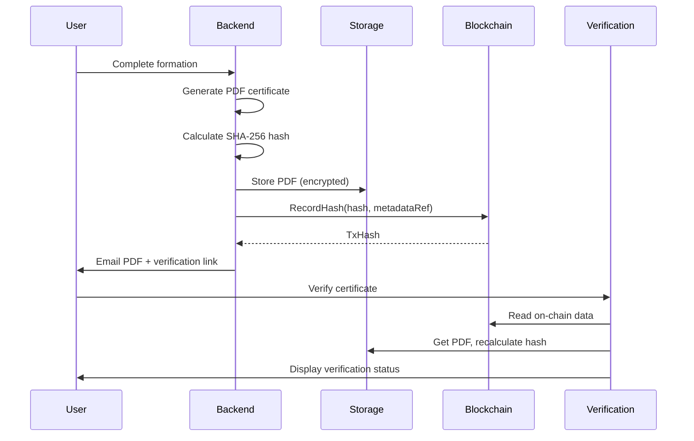

---
**DOCUMENT CONFIDENTIEL


# PDD - PLAN DE DÉVELOPPEMENT DÉTAILLÉ V2.0
## PYGMALION - Marketplace de Formation Aéronautique avec Certification Hashrecord

**Projet :** Pygmalion - Plateforme de Formation Aéronautique Certifiée
**Version :** 2.0
**Date :** Août 2025
**Classification :** Confidentiel
**Durée totale :** 320 jours de développement

---

## 1. SYNTHÈSE EXÉCUTIVE

### 1.1 Vision du projet

Pygmalion est une marketplace hypersécurisée spécialisée dans la formation aéroportuaire, intégrant un LMS propriétaire développé entièrement en interne (pas de dépendance Moodle ou autre) et un système innovant de certification hashrecord sur Avalanche. La plateforme révolutionne la gestion de la formation dans le secteur aéronautique en offrant une solution tout-en-un : découverte, inscription, formation, certification et vérification.

### 1.2 Proposition de valeur unique

- **Pour les apprenants :** Certificats infalsifiables vérifiables instantanément via hashrecord
- **Pour les entreprises :** Réduction de 60% du temps administratif, conformité garantie à 100%
- **Pour les OF :** Augmentation de 40% du CA, automatisation complète
- **Pour les gestionnaires d'aéroport :** Vision temps réel de la conformité, risque réduit de 90%

### 1.3 Chiffres clés du développement

- **Durée totale :** 320 jours
- **Répartition :** P0 (180j - 56%), P1 (100j - 31%), P2 (40j - 13%)
- **Budget estimé :** 1.35-1.8M€
- **ROI attendu :** Break-even en 8-18 mois (scénario conservateur : 12-18 mois ; scénario ambitieux : 8-12 mois)
- **Utilisateurs cibles année 1 :** 400-10,000 (scénario conservateur : 400-2,000 ; scénario ambitieux : 2,000-10,000)

---

## 2. CONTEXTE & ENJEUX

### 2.1 Problématiques du marché

Le secteur aéronautique fait face à des défis critiques :

- **Fragmentation :** 200+ organismes de formation isolés sans visibilité
- **Complexité réglementaire :** 15+ systèmes différents par aéroport
- **Risques de conformité :** 30% de non-conformités détectées en audit DGAC
- **Inefficacité administrative :** 45% du temps RH sur la gestion des formations
- **Fraude certificats :** Absence de système de vérification fiable

### 2.2 Opportunité de marché

- **Marché global :** 8.5 Mds € (formation aéronautique mondiale)
- **Marché adressable :** 2.3 Mds € (Europe + Moyen-Orient)
- **Croissance annuelle :** +12% CAGR
- **Taux de digitalisation actuel :** <15% (forte opportunité)

### 2.3 Cadre réglementaire

- **DGAC/EASA :** Exigences strictes de traçabilité et conformité
- **Qualiopi :** Certification qualité obligatoire pour les OF
- **RGPD :** Protection des données personnelles
- **Hashrecord :** Système de certification sécurisé avec vérification publique sur Avalanche

---

## 3. ARCHITECTURE TECHNIQUE

### 3.1 Stack technologique

**Frontend
- Framework : React 18 + TypeScript
- Build : Vite
- Styling : Tailwind CSS
- State : Context API + React Query
- Mobile : PWA responsive

**Backend
- Framework : NestJS (Node.js)
- Base de données : PostgreSQL + Prisma ORM
- Auth : Supabase Auth + JWT
- Storage : Supabase Storage (documents)
- Cache : Redis (sessions, rate limiting)
- Queue : RabbitMQ/Bull (jobs asynchrones)

**Certification Hashrecord
- Système : Hashrecord propriétaire
- Authentification : Clés sécurisées pour les OF
- Development : TypeScript + NestJS
- Standards : Hash SHA-256 unique par certificat
- API : REST pour vérification publique

**Infrastructure
- Cloud : AWS (EC2, RDS, CloudFront)
- Stockage documents : Supabase Storage (S3)
- CI/CD : GitLab CI avec quality gates
- Monitoring : Datadog APM
- Sécurité : WAF, rate limiting, CORS

### 3.2 Architecture système

```
┌─────────────────────────────────────────────────────────┐
│                    FRONTEND (React PWA)                  │
│  ┌──────────┐ ┌──────────┐ ┌──────────┐ ┌──────────┐   │
│  │Dashboard │ │Marketplace│ │   LMS    │ │  Admin   │   │
│  └──────────┘ └──────────┘ └──────────┘ └──────────┘   │
└─────────────────────────┬───────────────────────────────┘
                          │ HTTPS/WSS
┌─────────────────────────┴───────────────────────────────┐
│                   API GATEWAY (NestJS)                   │
│  ┌──────────┐ ┌──────────┐ ┌──────────┐ ┌──────────┐   │
│  │   Auth   │ │ Courses  │ │Enrollment│ │Hashrecord│   │
│  │          │ │          │ │          │ │(Avalanche)│  │
│  └──────────┘ └──────────┘ └──────────┘ └──────────┘   │
└─────────┬──────────┬──────────┬──────────┬─────────────┘
          │          │          │          │
    ┌─────┴────┐ ┌──┴───┐ ┌───┴───┐ ┌────┴─────┐
    │PostgreSQL│ │Redis │ │Storage│ │Avalanche │
    └──────────┘ └──────┘ └───────┘ └──────────┘
```

### 3.3 Flux de certification hashrecord



---

## 4. PLAN DE DÉVELOPPEMENT 320 JOURS

### 4.1 Vue d'ensemble

| Phase | Priorité | Description | Durée | % Total |
|-------|----------|-------------|-------|---------|
| **P0** | CRITIQUE | Fonctionnalités indispensables pour le lancement | 180j | 56% |
| **P1** | IMPORTANT | Conformité avancée et gestion entreprise | 100j | 31% |
| **P2** | OPTIMISATION | Qualité, performance et scalabilité | 40j | 13% |

### 4.2 Phase P0 - CRITIQUE (180 jours)

**Note : Le LMS propriétaire est développé progressivement sur les 3 phases (P0: 20j Core, P1: 15j Fonctionnel, P2: 10j Optimisé = 45j total)

#### 4.2.1 Authentification & Sécurité (34 jours)

**MFA/OTP obligatoire (6 jours)
- Authentification multi-facteurs avec TOTP/SMS
- Gestion des appareils de confiance
- Codes de secours sécurisés
- Verrouillage progressif (3/5/10 tentatives)
- Parcours de récupération sécurisé

**Validation KYC/KYB/CAC - P0 Manuel (8 jours)
- Collecte structurée selon le rôle (Apprenant/OF/Entreprise)
- Upload sécurisé de documents (CNI, Kbis, badges aéro)
- Interface admin de validation manuelle avec checklist
- Workflow simple : upload → vérification manuelle → validation
- Statuts temps réel (en attente/vérifié/rejeté)
- Notifications email sur changement de statut
- Audit trail complet horodaté pour conformité

**LMS Core Minimal P0 (20 jours)
- Architecture de base LMS avec modèles de données Prisma
- Authentification unifiée Marketplace-LMS
- Structure cours/modules/leçons basique
- Lecteur vidéo simple (HTML5/YouTube)
- Quiz basiques (QCM uniquement)
- Tracking progression simple
- Interface apprenant minimale
- Tests et intégration basique

#### 4.2.2 Certification Hashrecord sur Avalanche (20 jours)

**Smart Contract HashRegistry (8 jours)
- Développement smart contract HashRegistry sur Avalanche
- Stockage on-chain : hash SHA-256, metadataRef (pointeur off-chain)
- Fonctions : recordHash(), revokeHash(), isValid()
- Rôles : ISSUER, ADMIN avec AccessControl
- Tests unitaires 100% coverage
- Déploiement testnet Fuji puis mainnet

**Page Vérification Publique (5 jours)
- Interface `/verify/:certId/:hash`
- Lecture du hash et métadonnées hashrecord
- Comparaison avec PDF stocké
- Affichage statut (valid/revoked/expired)
- QR code pour partage mobile
- API REST publique documentée

**Intégration Workflow (4 jours)
- Pipeline : PDF → SHA256 → recordHash() → Persist
- Gestion simplifiée des wallets apprenants
- Notifications multi-canal (email, SMS, push)
- Archivage dual (PDF + hashrecord)
- Mécanisme de retry idempotent

**Infrastructure Hashrecord (3 jours)
- Configuration système hashrecord sur Avalanche HA
- Gestion sécurisée des clés (hot wallet P0)
- Monitoring transactions temps réel
- Estimation et optimisation coûts gas par transaction d'enregistrement
- Fallback en cas d'indisponibilité

#### 4.2.3 Core Marketplace (49 jours)

**Finalisation Marketplace (12 jours)
- Fiches formation complètes (Qualiopi, SMART)
- Moteur de recherche avec filtres avancés
- Tri multi-critères et pagination performante
- Optimisation SEO technique
- Contrôles d'accès par rôle


**Validation OF (7 jours)
- Workflow 4 étapes progressif
- Validation documentaire (Kbis, Qualiopi)
- Signature électronique CDC/CGU/CGV
- Horodatage certifié eIDAS
- Piste d'audit immuable

**Import contenus (5 jours)
- Upload multi-format (PDF, SCORM, vidéo)
- Détection automatique du type
- Extraction automatique des métadonnées
- Validation conformité Qualiopi
- Conversion formats web optimisés

**Paiements Stripe (15 jours)
- Checkout optimisé (Apple/Google Pay)
- Webhooks idempotents sécurisés HMAC
- Stripe Connect pour commissions
- Refunds automatisés basiques
- Factures conformes numérotées
- Réconciliation simplifiée

**Intégration Marketplace-LMS natif (4 jours)
- Provisioning instantané (même DB PostgreSQL)
- Création automatique des accès cours
- Synchronisation native des droits
- Pas d'API externe, tout en interne
- Accès garanti <5 secondes


**Tableaux conformité Entreprise/Manager (3 jours)
- Dashboard conformité des employés de l'entreprise
- Niveaux : certifications valides/expirées/à renouveler
- Drill-down par service/métier
- Alertes proactives non-conformités
- Export PDF pour audits internes

**Dashboard Gestionnaire Aéroport P0 - Basique (3 jours)
- Vue en lecture seule de la conformité globale
- Liste des entreprises affiliées sur le site
- Alertes conformité critiques
- Exports PDF pour reporting DGAC
- Interface simplifiée sans actions d'administration

#### 4.2.4 Documents & Communications (20 jours)

**Certificats & attestations PDF (10 jours)
- Génération automatique personnalisée
- Émargement détaillé par demi-journée
- Attestations avec compétences RNCP
- Certificats avec QR code hashrecord
- Stockage chiffré AES-256
- Liens temporaires signés 24h

**Emails automatiques (8 jours)
- Système event-driven intelligent
- Templates multilingues (FR/EN/ES)
- Personnalisation dynamique contextuelle
- Optimisation délivrabilité (SPF/DKIM/DMARC)
- Bounce management automatique
- Logs searchable pour support


**Notifications Push/SMS (2 jours)
- Alertes critiques haute priorité
- Opt-in/opt-out granulaire
- Delivery reports temps réel
- Fallback cascade (push→SMS→email)
- Respect RGPD strict

#### 4.2.5 Infrastructure & Production (26 jours)

**Tests essentiels (9 jours)
- Tests unitaires 80% coverage
- Tests d'intégration API
- Tests e2e Cypress critiques
- Tests de charge 1000 users
- Simulation pannes et recovery
- Tests hashrecord (création, vérification, révocation)

**Déploiement cloud (8 jours)
- Infrastructure as Code (Terraform)
- Kubernetes avec auto-scaling
- Secrets management (Vault)
- CI/CD GitLab avec quality gates
- Blue-green deployment
- Rollback automatique <30s

**Configuration BDD (4 jours)
- Multi-environnements (dev/staging/prod)
- PostgreSQL réplication master-slave
- Migrations Prisma versionnées
- Backups 3-2-1 (hourly + WAL)
- Point-in-time recovery <5min
- Chiffrement TDE + SSL

**Documentation API (4 jours)
- OpenAPI 3.1 complète interactive
- Exemples requêtes/réponses
- Codes erreur avec solutions
- Guide auth OAuth2/JWT
- Webhooks et rate limits
- SDKs générés (JS/Python)

**Durcissement sécurité (3 jours)
- CORS restrictif par origine
- Helmet.js 15+ headers
- Rate limiting adaptatif Redis
- Protection CSRF double-submit
- Validation schemas JSON
- WAF rules personnalisées

#### 4.2.6 Conformité & Gestion (31 jours)

**Alertes conformité (13 jours)
- Notifications J-90/60/30/7/1
- Multi-canal (email, SMS, push)
- Anti-doublons avec dedup key
- Escalade managériale automatique
- Tableaux de bord consolidés
- Logs d'audit complets

**Import personnel (8 jours)
- Template XSD standardisé
- Import batch 1000 avec progress
- Détection doublons intelligente
- Validation métier complexe
- Rapport erreurs ligne par ligne
- Affiliation automatisée

**Assignation interne (10 jours)
- Workflow Manager configurable
- Décrémentation atomique places
- Gestion budgets formation
- Notifications temps réel
- Tableaux analytiques
- Export Excel historique


### 4.2.7 (Section remplacée - Le LMS est maintenant réparti sur les 3 phases)

### 4.3 Phase P1 - IMPORTANT (100 jours)

#### 4.3.0 LMS Fonctionnel (15 jours)

**Éditeur de cours avancé (3 jours)
- Interface drag-and-drop pour création de contenus
- Templates réutilisables  
- Import PowerPoint/Word
- Versioning automatique

**Types de quiz étendus (2 jours)
- Questions ouvertes, glisser-déposer, associations
- Feedback personnalisé et parcours adaptatifs
- Calculs et formules

**Forums/discussions (3 jours)
- Système de discussion threadé par cours/session
- Notifications temps réel WebSocket
- Modération par formateurs
- Mentions et tags

**Support SCORM/xAPI (3 jours)
- Import/export packages SCORM 1.2/2004
- Tracking xAPI complet
- Compatibilité contenus tiers existants

**Reporting formateur (2 jours)
- Tableaux de bord progression apprenants
- Statistiques par module
- Identification points de blocage
- Exports Excel

**Notifications temps réel (2 jours)
- Push notifications navigateur
- Emails récapitulatifs
- Alertes in-app
- Préférences granulaires

#### 4.3.1 Éléments déplacés de P0 (20 jours)

**Module Formateur (8 jours)
- Profils complets avec qualifications aéronautiques
- Affiliation multi-OF avec validation
- Dépôt sécurisé supports pédagogiques
- Versioning automatique documents
- Badges et certifications visibles

**Affiliation Apprenant↔Entreprise (5 jours)
- Workflow validation bidirectionnel
- Tokens temporaires sécurisés
- Notifications push temps réel
- Application rétroactive des droits
- Intégration SIRH possible

**Wallet Documents Entreprise (5 jours)
- Coffre-fort chiffré AES-256
- Versioning illimité avec diff
- Partage granulaire avec expiration
- OCR et recherche full-text
- Audit trail immutable

#### 4.3.2 Conformité Qualiopi (18 jours)

**Pack Qualiopi complet (9 jours)
- 32 indicateurs intégrés
- Questionnaires T0/T+90 adaptatifs
- Analyse automatique des réponses
- Tableaux conformité temps réel
- Génération preuves audit
- Alertes prédictives

**Documents pédagogiques (9 jours)
- Déroulé pédagogique structuré
- Fiches séances horodatées
- Barèmes personnalisables
- Modèles réutilisables
- Validation collaborative
- Versioning complet

#### 4.3.3 Gestion Entreprise (30 jours)

**Budget formation (8 jours)
- Enveloppes multi-niveaux
- Règles éligibilité complexes
- Suivi consommation temps réel
- Prévisionnel basé sur historique 3 ans
- Simulations what-if
- Exports comptables

**KPIs avancés (8 jours)
- 50+ KPIs métier
- Widgets drag-and-drop
- Drill-down multi-niveaux
- Analyses avancées
- Exports programmés
- API GraphQL BI

**Gestionnaire Aéroport Complet P1 (5 jours)
- Vue consolidée avancée multi-sites
- Agrégation données multi-entreprises temps réel
- Workflows validation croisée inter-sites
- Benchmarking automatique secteur
- Carte interactive alertes géolocalisées
- Conformité par zone/terminal
- Reporting DGAC/EASA unifié
- Actions d'administration avancées

#### 4.3.4 Validation & Contrôle (17 jours)

**Workflow OF complet (2 jours)
- Vue kanban drag-drop
- Timeline interactions
- Templates réponse
- SLA tracking
- Escalade automatique

**Import/Export avancé (2 jours)
- Import 100k+ lignes
- Query builder visuel
- Templates sauvegardables
- Rapports réglementaires
- API batch ETL

**KYC/KYB/CAC - P1 Semi-Automatisé (4 jours)
- OCR pour extraction automatique des données
- Pré-validation automatique (formats, dates expiration)
- Score de confiance avec alertes sur anomalies
- Intégration bases publiques (INSEE, Infogreffe)
- Workflow de révision manuelle pour cas limites (<20%)
- Réduction du temps de validation de 70%

**Surveillance examens (2 jours)
- Proctoring léger
- Patterns anormaux
- Enregistrement audio
- Alertes temps réel
- Score intégrité

**Exports légaux (2 jours)
- BPF/CERFA automatiques
- Validation exhaustive
- Signature qualifiée
- Transmission SFTP
- Archivage 10 ans

**Parcours sur-mesure (7 jours)
- Plateforme B2B collaborative
- Tests positionnement adaptatifs
- Devis détaillés options
- Planning simulator
- Conventions spécifiques

**Modération qualité (1 jour)
- Seuil 3.8/5 automatisé
- Escalade progressive
- Plans correction
- Analyses de tendances

### 4.4 Phase P2 - OPTIMISATION (40 jours)

#### 4.4.0 LMS Optimisé (10 jours)

**Mode hors-ligne PWA (2 jours)
- Application Progressive Web App
- Cache offline complet
- Synchronisation différée des données
- Accès aux contenus téléchargés sans connexion

**Analytics avancés (2 jours)
- ML pour prédiction décrochage
- Recommandations personnalisées de contenus
- Parcours adaptatifs intelligents
- Tableaux de bord analytics avancés

**IA adaptative (3 jours)
- Ajustement automatique difficulté
- Recommandations basées sur profil apprenant
- Chatbot IA support
- Système d'apprentissage adaptatif

**Proctoring avancé (3 jours)
- Surveillance avec reconnaissance faciale
- Détection mouvements anormaux via IA
- Enregistrement vidéo sécurisé
- Rapport détaillé intégrité

#### 4.4.1 KYC/KYB/CAC - P2 Entièrement Automatisé (4 jours)

**Automatisation complète avec IA
- Intégration services spécialisés (Onfido, Jumio, ComplyAdvantage)
- Vérification biométrique avec liveness detection
- Reconnaissance faciale et matching documents
- Screening PEP/sanctions en temps réel
- API directe avec autorités aéroportuaires (DGAC)
- Machine Learning pour détection de fraude
- Validation automatique >95% des cas
- Temps de validation <2 minutes

#### 4.4.2 Qualité & Tests (11 jours)

**Tests automatisés (4 jours)
- Coverage 85% complet
- Tests mutation Stryker
- Analyse SonarQube
- Tests régression visuels
- Smoke tests production

**E2E complets (3 jours)
- Cypress/Playwright multi-browser
- Tests mobile devices réels
- Performance K6
- Accessibilité automatisée
- Localisation

**Audit OWASP (2 jours)
- Scan Top 10 complet
- SAST/DAST continu
- Dependency scanning
- Penetration testing
- Score sécurité A+

**Documentation (2 jours)
- Architecture C4 model
- Guides best practices
- Runbooks opérationnels
- Knowledge base
- Vidéos formation

#### 4.4.3 Performance & UX (8 jours)

**Optimisation (2 jours)
- Temps chargement <1.5s
- Code splitting agressif
- Cache multi-niveaux
- Images WebP/AVIF
- Service Worker offline

**Mobile (2 jours)
- PWA mobile-first
- Touch gestures natifs
- Offline mode partiel
- Réduction bande passante 50%
- Tests 20+ devices

**UX améliorée (2 jours)
- User research interviews
- A/B testing features
- Personnalisation intelligente
- Animations 60fps
- Dark mode

**Accessibilité (2 jours)
- WCAG 2.1 niveau AA
- Navigation clavier
- Lecteurs écran
- Contrastes validés
- Sous-titres vidéos

#### 4.4.4 Monitoring & DevOps (7 jours)

**APM complet (2 jours)
- Datadog métriques temps réel
- Distributed tracing
- Profiling continu
- Dashboards métier
- SLO/SLI tracking

**CI/CD avancé (2 jours)
- 15+ quality gates
- Feature flags LaunchDarkly
- Canary deployments
- Rollback métriques
- Changelog auto

**Backup & DR (2 jours)
- Stratégie 3-2-1
- Cross-region replication
- Tests restauration mensuels
- RTO <2h / RPO <1h
- Failover automatique

**SSO entreprises (1 jour)
- SAML 2.0/OIDC
- AD/Azure AD/Okta
- Mapping groupes auto
- SCIM provisioning
- Multi-tenancy


---

## 5. LIVRABLES & JALONS

### 5.1 Jalons principaux

| Jalon | Date | Livrables clés | Critères de succès |
|-------|------|----------------|-------------------|
| **M1** | J60 | Infrastructure hashrecord + Auth/Security | Système hashrecord déployé, MFA fonctionnel |
| **M2** | J120 | Marketplace + Paiements | Stripe intégré, 10+ formations publiées |
| **M3** | J180 | MVP complet | Tokenisation active, 100+ users test |
| **M4** | J240 | Conformité avancée | Qualiopi intégré, multi-sites OK |
| **M5** | J320 | Production optimisée | Performance <1.5s, 99.9% uptime |

### 5.2 Definition of Done

**Pour chaque fonctionnalité :
- ✅ Code review approuvé (2+ reviewers)
- ✅ Tests unitaires >80% coverage
- ✅ Tests d'intégration passés
- ✅ Documentation API à jour
- ✅ Validation Product Owner
- ✅ Déployé en staging
- ✅ Tests de non-régression OK

**Pour le système hashrecord :
- ✅ Smart contract audité
- ✅ Tests sur testnet Fuji
- ✅ Coûts gas < 2$ par transaction d'enregistrement
- ✅ Page vérification publique active
- ✅ Fallback PDF fonctionnel
- ✅ Monitoring transactions actif

---

## 6. ORGANISATION & RESSOURCES

### 6.1 Équipe projet

**Core Team (8-10 personnes)
- 1 Product Owner
- 1 Tech Lead / Architecte
- 2 Développeurs Frontend Senior
- 2 Développeurs Backend Senior
- 1 Développeur Certification Hashrecord
- 1 DevOps/SRE
- 1 UX/UI Designer
- 1 QA Engineer

**Support (temps partiel)
- 1 Expert sécurité
- 1 Expert conformité aéronautique
- 1 Data analyst
- 1 Customer Success Manager

### 6.2 Méthodologie

- **Framework :** Agile Scrum adapté
- **Sprints :** 2 semaines
- **Cérémonies :** Daily, Sprint Planning, Review, Retro
- **Outils :** Jira, GitLab, Slack, Figma
- **Documentation :** Confluence, Swagger

### 6.3 Budget prévisionnel

| Poste | Coût estimé | % Total |
|-------|------------|---------|
| **Développement** | 800-1000k€ | 55% |
| **Infrastructure** | 150-200k€ | 12% |
| **Certification Hashrecord** | 100-150k€ | 8% |
| **Licences/Services** | 80-120k€ | 7% |
| **Sécurité/Audit** | 70-100k€ | 6% |
| **Marketing/Launch** | 100-150k€ | 8% |
| **Buffer/Imprévus** | 50-80k€ | 4% |
| **TOTAL** | **1.35-1.8M€** | **100%** |

---

## 7. RISQUES & MITIGATIONS

### 7.1 Risques techniques

| Risque | Impact | Probabilité | Mitigation |
|--------|--------|-------------|------------|
| **Complexité hashrecord** | Élevé | Moyenne | POC progressif, expertise externe, fallback PDF |
| **Performance à l'échelle** | Élevé | Faible | Architecture scalable, cache agressif, CDN |
| **Développement LMS interne** | Élevé | Faible | LMS propriétaire, contrôle total, pas de dépendance externe |
| **Sécurité données** | Critique | Faible | Audits réguliers, pentest, chiffrement |

### 7.2 Risques business

| Risque | Impact | Probabilité | Mitigation |
|--------|--------|-------------|------------|
| **Adoption utilisateurs** | Élevé | Moyenne | UX simplifiée, onboarding guidé, support |
| **Réglementation crypto** | Élevé | Faible | Veille juridique, conseil spécialisé |
| **Concurrence** | Moyen | Moyenne | Innovation continue, partenariats exclusifs |
| **Financement** | Élevé | Faible | Phases progressives, revenus early adopters |

---

## 8. MÉTRIQUES DE SUCCÈS

### 8.1 KPIs techniques

- **Disponibilité :** >99.9% uptime
- **Performance :** <1.5s temps de chargement
- **Sécurité :** 0 breach, score A+ OWASP
- **Qualité code :** >80% test coverage
- **Hashrecord :** <30s émission (tx minée), fiabilité ≥99.9%, coûts gas <$2 par transaction d'enregistrement

### 8.2 KPIs business

- **Utilisateurs :** 400-10,000 actifs année 1 (scénario conservateur : 400-2,000 ; scénario ambitieux : 2,000-10,000)
- **OF partenaires :** 5-10 validés en 6 mois
- **Formations :** 500+ actives année 1
- **Taux conversion :** >15% visiteur→inscrit
- **NPS :** >50 année 1, >60 année 2
- **ARR :** 200K-1.5M€ (scénario conservateur : 200-500K€ année 1 ; scénario ambitieux : 500K-1.5M€ année 1)

### 8.3 KPIs conformité

- **Certificats tokenisés :** >95% succès
- **Vérifications publiques :** >1000/mois
- **Conformité équipes :** >98% à jour
- **Alertes traitées :** <24h résolution
- **Audits réussis :** 100% DGAC/Qualiopi

---

## 9. ROADMAP POST-MVP

### Phase 2 - Expansion (Mois 13-18)
- Intégrations OPCO/CPF
- Système anti-fraude IA avancé
- Analytics prédictifs ML
- Mobile apps natives
- Expansion européenne

### Phase 3 - Leadership (Mois 19-24)
- IA générative pour contenus
- Marketplace formateurs
- Certifications IATA/OACI
- API marketplace ouverte
- Préparation IPO

---

## 10. CONCLUSION

Ce PDD V2.0 définit un plan ambitieux mais réaliste pour faire de Pygmalion la référence mondiale de la formation aéronautique certifiée. L'innovation hashrecord sur Avalanche, combinée à une approche centrée utilisateur et une conformité irréprochable, positionnera MB Aviation comme leader incontesté du marché.

**Facteurs clés de succès :
- ✅ Équipe expérimentée (20+ ans aviation)
- ✅ Innovation technologique (hashrecord sur Avalanche + IA)
- ✅ Partenariats stratégiques (OF, aéroports)
- ✅ Time-to-market optimal (MVP en 6 mois)
- ✅ Modèle économique validé (commission pure)

---

**© 2025 MB Aviation - Document confidentiel

**Rédacteurs :** Robin Navarro (CEO), Aurélien Francio (CTO), Pierre Beunardeau (COO)

*Ce document est la propriété exclusive de MB Aviation. Toute reproduction ou distribution non autorisée est strictement interdite.*

## 11. ÉTAT ACTUEL DU DÉVELOPPEMENT

### 11.1 Travail réalisé (12 jours - ~20% du code)

Après 12 jours de développement initial, les bases techniques sont posées mais nécessitent une industrialisation complète :

| Composant | État | Reste à faire |
|-----------|------|---------------|
| **Auth/Sécurité** | 22% - Base Supabase fonctionnelle | MFA, KYC/KYB, RBAC complet |
| **Catalogue** | 20% - Structure et recherche basique | Filtres avancés, Qualiopi |
| **LMS propriétaire** | 5% - Architecture définie | Développement complet du LMS interne |
| **Hashrecord** | 0% - Non démarré | Système certification, page vérification |
| **Paiements** | 0% - Non démarré | Intégration Stripe complète |
| **Emails/PDF** | 0% - Non démarré | Système event-driven |

### 11.2 Effort réel restant

- **Code à écrire :** 85% du total
- **Tests à créer :** 100% (aucun test unitaire/e2e)
- **Infrastructure :** 95% (déploiement, CI/CD, monitoring)
- **Documentation :** 100% (API, utilisateur, technique)

Cette base de 12 jours représente une exploration technique validant la faisabilité. Le plan de 320 jours intègre cette réalité pour livrer une solution production-ready.