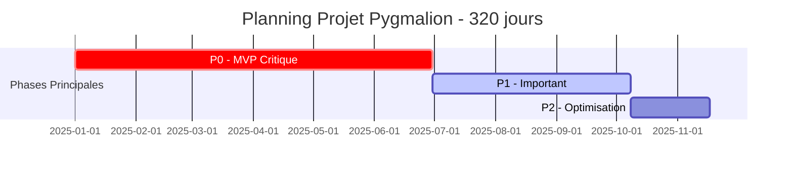
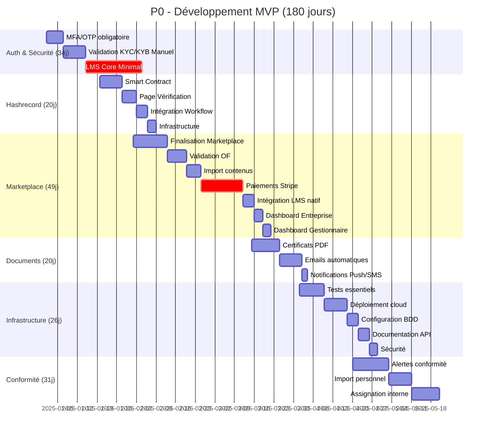
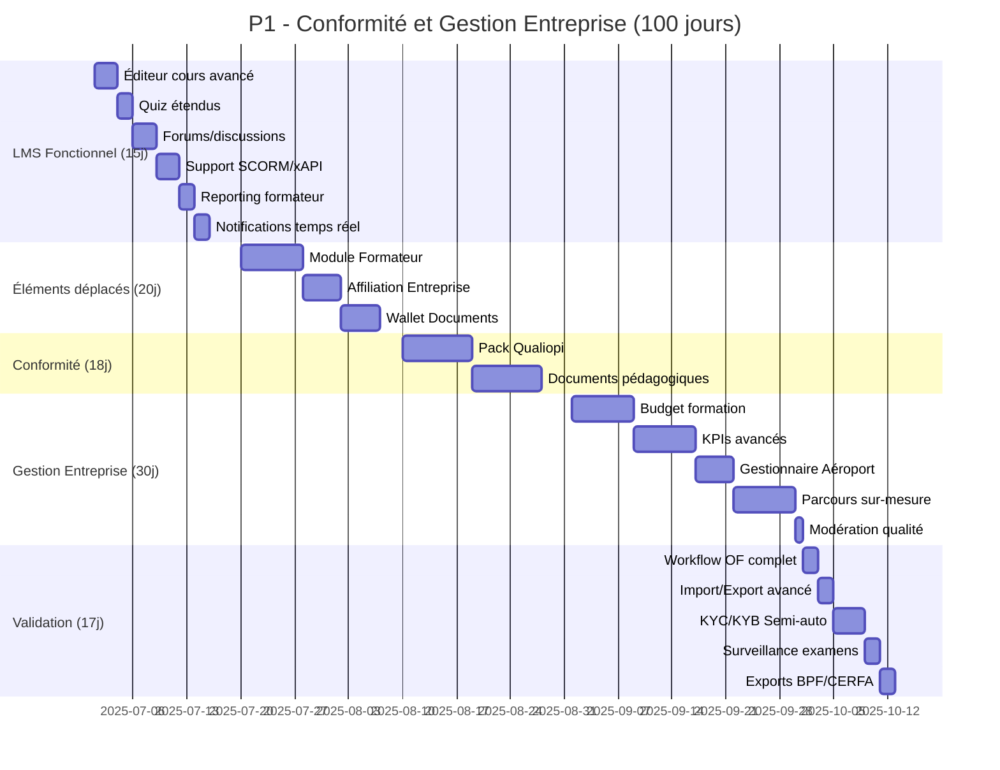
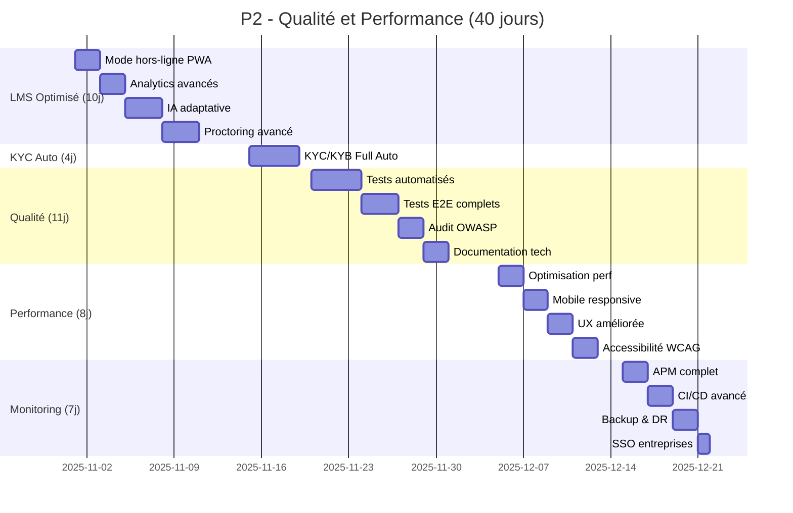

# Planning Gantt - Projet Pygmalion (320 jours)

## Vue d'ensemble des phases

## Phase P0 - CRITIQUE (180 jours) - Détail

## Phase P1 - IMPORTANT (100 jours) - Détail

## Phase P2 - OPTIMISATION (40 jours) - Détail

## Dépendances critiques

### Chemin critique principal
1. **Auth & Sécurité** (34j) → Base nécessaire pour tout le système
2. **LMS Core** (20j P0) → Prérequis pour les fonctionnalités formation
3. **Paiements Stripe** (15j) → Monétisation essentielle
4. **Hashrecord** (20j) → Innovation différenciante, peut être parallélisé
5. **Tests & Déploiement** (26j) → Validation avant production

### Dépendances inter-modules
- **LMS Core (P0)** → **LMS Fonctionnel (P1)** → **LMS Optimisé (P2)**
- **Dashboard Gestionnaire Basique (P0)** → **Gestionnaire Complet (P1)**
- **KYC Manuel (P0)** → **KYC Semi-auto (P1)** → **KYC Full Auto (P2)**
- **Marketplace** → **Intégration LMS** → **Tableaux de bord**

### Parallélisation possible
- **Hashrecord** peut être développé en parallèle de la Marketplace
- **Documentation** peut commencer dès que les modules sont stabilisés
- **Tests** peuvent être écrits en parallèle du développement
- **Infrastructure** peut être préparée en avance

## Jalons principaux

| Jalon | Date (estimation) | Livrables clés |
|-------|------------------|----------------|
| **M1** | J60 | Auth/Security + LMS Core démarré |
| **M2** | J120 | Marketplace + Paiements + Hashrecord |
| **M3** | J180 (Fin P0) | MVP complet, prêt pour beta test |
| **M4** | J280 (Fin P1) | Conformité complète + Entreprise features |
| **M5** | J320 (Fin P2) | Production optimisée, ready to scale |

## Ressources requises par phase

### P0 - MVP (180j)
- **Dev Frontend** : 2 seniors temps plein
- **Dev Backend** : 2 seniors temps plein  
- **Dev Blockchain** : 1 spécialiste (20j)
- **DevOps** : 1 senior (mi-temps)
- **Product Owner** : 1 temps plein
- **QA** : 1 temps plein (à partir de J90)

### P1 - Important (100j)
- **Dev Frontend** : 2 seniors temps plein
- **Dev Backend** : 2 seniors temps plein
- **Dev LMS** : 1 spécialiste (15j)
- **DevOps** : 1 senior temps plein
- **QA** : 1 senior temps plein
- **Conformité** : 1 expert (mi-temps)

### P2 - Optimisation (40j)
- **Dev Frontend** : 1 senior temps plein
- **Dev Backend** : 1 senior temps plein
- **Dev IA/ML** : 1 spécialiste (10j)
- **DevOps** : 1 senior temps plein
- **QA** : 2 seniors temps plein
- **Security** : 1 expert (audit)

## Risques et mitigations

| Risque | Impact | Probabilité | Mitigation | Buffer |
|--------|--------|-------------|------------|--------|
| **LMS sous-estimé** | Élevé | Moyenne | Développement progressif sur 3 phases | +10j inclus |
| **Intégration Stripe** | Moyen | Faible | Utilisation Stripe Checkout standard | +3j prévu |
| **Hashrecord complexité** | Élevé | Moyenne | POC early, fallback PDF ready | +5j prévu |
| **Conformité Qualiopi** | Moyen | Faible | Expert dédié en P1 | Buffer P1 |
| **Performance scale** | Moyen | Faible | Architecture scalable dès P0 | P2 dédié |

## Points d'attention

1. **LMS progressif** : Le développement sur 45j (20+15+10) est plus réaliste que 10j initial
2. **Gestionnaire Aéroport** : Périmètre clarifié P0 basique / P1 complet
3. **Optimisations P0** : Réduction justifiée sur Stripe, PDF, emails pour compenser LMS
4. **Wallet Documents** : Ajouté en P1 comme demandé, 5j maintenus
5. **Parcours sur-mesure** : Augmenté à 8j pour importance stratégique

---

*Document généré le : 2025-01-XX*
*Version : 2.0 - Post réallocation*
*Durée totale : 320 jours*
*Budget maintenu : 1.35-1.8M€*